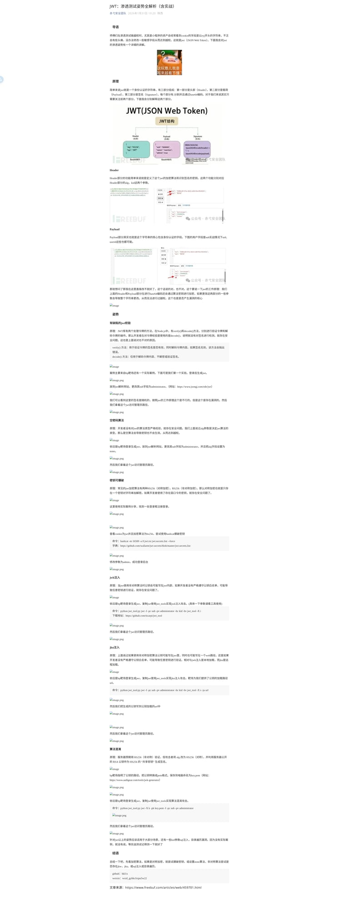

# JWT：渗透测试姿势全解析（含实战）

> 来源：微信公众号「赤弋安全团队」
> 作者：hkl1x
> 日期：2026年1月31日

---

## 一、原理

### JWT 简介

JWT（JSON Web Token）是一个身份认证的字符串，由三部分组成：

| 部分 | 说明 |
|------|------|
| Header | 头部，包含加密算法和密钥信息 |
| Payload | 载荷，包含身份认证的核心字段 |
| Signature | 签名 |

每个部分用 `.` 分割并通过 Base64 编码。



---

### Header

Header 部分功能：
- 定义 JWT 的**加密算法**（alg 参数）
- 定义**识别签名的密钥**（kid 参数）


### Payload

Payload 是 JWT 的核心，包含身份认证字段，常见字段：
- `sub`（用户标识）
- `uid`、`userid` 等


### 工作原理

修改 Header 或 Payload 部分会导致整个字符串变化，从而无法通过验证。

---

## 二、渗透姿势

### 1. 有缺陷的 JWT 校验

**原理**：
- `verify()` 方法：验证签名有效，同时解码令牌
- `decode()` 方法：**仅解码令牌，不验证签名**

如果开发者使用 `decode()` 而非 `verify()`，则存在越权漏洞。

**实战**：
1. 登录后获取 JWT
2. 放到 JWT 解析网站（如 https://www.jsongj.com/ede/jwt）
3. 修改 `sub` 字段为 `administrator`
4. 用修改后的 JWT 访问管理员路径


---

### 2. 空密码算法（None Algorithm）

**原理**：
- `alg` 参数设置为 `none`
- 密钥不生效，直接越权

**实战**：
1. 登录获取 JWT
2. 修改 `alg` 为 `none`，`sub` 为 `administrator`
3. 访问管理员路径


---

### 3. 密钥可爆破

**原理**：
- HS256（对称加密）使用单一密钥
- 弱口令密钥可被爆破

**工具**：
```bash
hashcat -m 16500 -a 0 jwt.txt jwt.secrets.list
```

**字典**：
- https://github.com/wallarm/jwt-secrets/blob/master/jwt.secrets.list

**实战**：
1. 获取 JWT，确认算法为 HS256
2. 爆破密钥
3. 修改参数为 admin，成功登录后台


---

### 4. JWK 注入

**原理**：
- JWT 使用非对称算法时，公钥可能写在 JWT 内部
- 未严格遵守公钥白名单 → 任意密钥验证

**工具**：
```bash
python jwt_tool.py jwt -I -pc sub -pv administrator -hc kid -hv jwt_tool -X i
```

**下载地址**：https://github.com/ticarpi/jwt_tool


---

### 5. JK 注入

**原理**：
- 与 JWK 类似，但公钥通过**远程 URL** 加载
- 未严格遵守公钥白名单

**命令**：
```bash
python jwt_tool.py jwt -I -pc sub -pv administrator -hc kid -hv jwt_tool -X s -ju url
```

**实战**：
1. 获取 JWT
2. 使用 jwt_tools 实现 jku 注入
3. 将生成的公钥写到公钥加载 URL
4. 访问管理员路径


---

### 6. 算法混淆（Algorithm Confusion）

**原理**：
- 服务器预期用 RS256（非对称）验证
- 攻击者将 alg 改为 HS256
- 用服务器公开的 RSA 公钥作为 HS256 的"共享密钥"

**步骤**：
1. 获取公钥，转换为 PEM 格式
2. 使用 jwt_tools 修改算法并生成签名
3. 访问管理员路径

**命令**：
```bash
python jwt_tool.py jwt -X k -pk key.pem -I -pc sub -pv administrator
```


---

### 7. 其他姿势

- **kid 参数 SQL 注入**
- **kid 参数目录遍历**

---

## 三、总结

**判断流程**：

```
1. 先看加密算法
   ↓
2. 对称加密（HS256）
   → 尝试爆破密钥
   → 设置 none 算法
   ↓
3. 非对称加密（RS256）
   → 尝试 JWK 注入
   → 尝试 JKU 注入
   → 尝试算法混淆
   ↓
4. 检查 kid 参数
   → SQL 注入
   → 目录遍历
```

---

## 四、参考

- 靶场：BurpSuite JWT Editor
- 工具：jwt_tool.py
- 字典：jwt.secrets.list
- 原文：https://www.freebuf.com/articles/web/459701.html

---

*本文档由 Agent 自动从微信公众号提取并整理*
*配图已保存到 ./images/2026-03-07-JWT渗透测试姿势.jpg*
